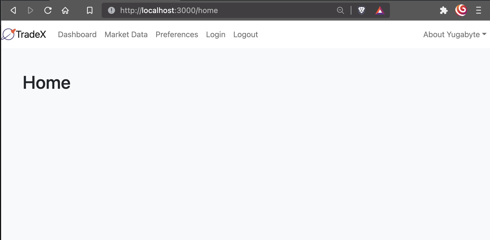
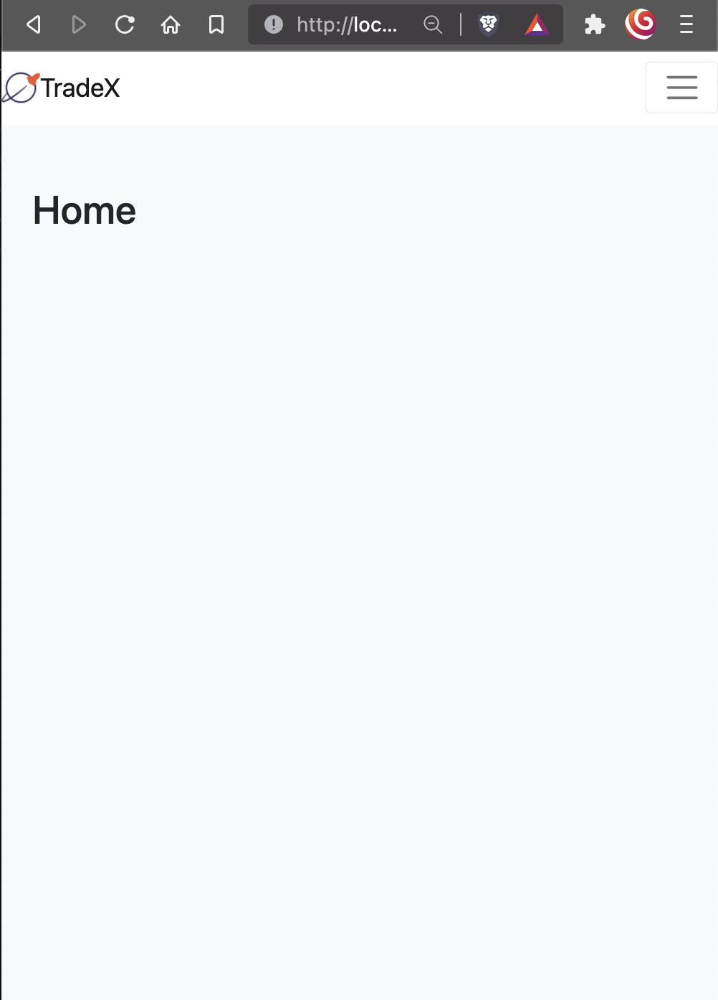

## Trading App / Preferences Module

## Get Started

1. Checkout

    ```bash
    git clone git@github.com:yugabyte/yugabyte-sample-trading-app.git
    ```

   *OR*

    ```bash
    git clone https://github.com/yugabyte/yugabyte-sample-trading-app.git
    ```

2. Create a multi region local cluster

    a. Destroy cluster first (if required)

    ```bash
    yb-ctl destroy
    ```

    a. Destroy cluster first (if required)

    ```bash
    yb-ctl --rf 3 create \
        --placement_info "aws.us-east-2.us-east-2c,aws.eu-central-1.eu-central-1c,aws.ap-southeast-1.ap-southeast-1c" \
        --tserver_flags="cql_nodelist_refresh_interval_secs=2" \
        --master_flags="tserver_unresponsive_timeout_ms=2000"
    ```

    a. Prepare the tablesapces using the sql script

    ```bash
    ysqlsh -f src/resource/db/0-prepare-yugabytedb.sql
    ```

3. Change to `preferences` directory

    ```bash
    cd yugabyte-sample-trading-app/prefrences
    ```

4. Clean out any unwanted files
    ```bash
    ./mvnw clean
    ```
5. Run App

    ```bash
    ./mvnw spring-boot:run -Dspring-boot.run.profiles=ysql
    ```

6. Package as JAR

    ```bash
    ./mvnw clean install
    ```

7. Package as a docker container

   ```bash
    ./mvnw spring-boot:build-image
    ```

8. Frontend development

   ```bash
   cd src/main/frontend
   npm run start
   ```

9. Deployment: App deployed for each region: US, AP and EU
```
US on ubuntu@3.19.28.255
APP_REGION=us INITIAL_YSQL_HOST=172.161.59.140 ./tradex-ubuntu.sh app-run

AP on ubuntu@13.214.136.26
APP_REGION=ap INITIAL_YSQL_HOST=172.156.63.168 ./tradex-ubuntu.sh app-run
```
## Links

| Link                                        | Description                                                                        |
|---------------------------------------------|------------------------------------------------------------------------------------|
| http://localhost:8080                       | Bundled UI - Only updated on restarting Java App                                   |
| http://localhost:3000                       | Live Development UI - Make change in the JS file and you will see the changes here |
| http://localhost:8080/actuator              | Monitoring URL root                                                                |
| http://localhost:8080/v3/api-docs           | Open API v3.0 Spec ( JSON )                                                        |
| http://localhost:8080/v3/api-docs.yaml      | Open API v3.0 Spec ( YAML )                                                        |
| http://localhost:8080/swagger-ui/index.html | Open API / Swagger UI                                                              |


## Screenshots

1. Main UI (Desktop)

    

2. Main UI (Mobile)

    
